# PromptCraft — Learn to Speak Fluent AI

PromptCraft is an interactive web app that teaches prompt engineering through hands-on lessons, a live AI-powered sandbox, guided missions, and a community prompt library. Instead of passive reading, users learn by doing — writing prompts, getting instant feedback, and iterating until they master the craft.

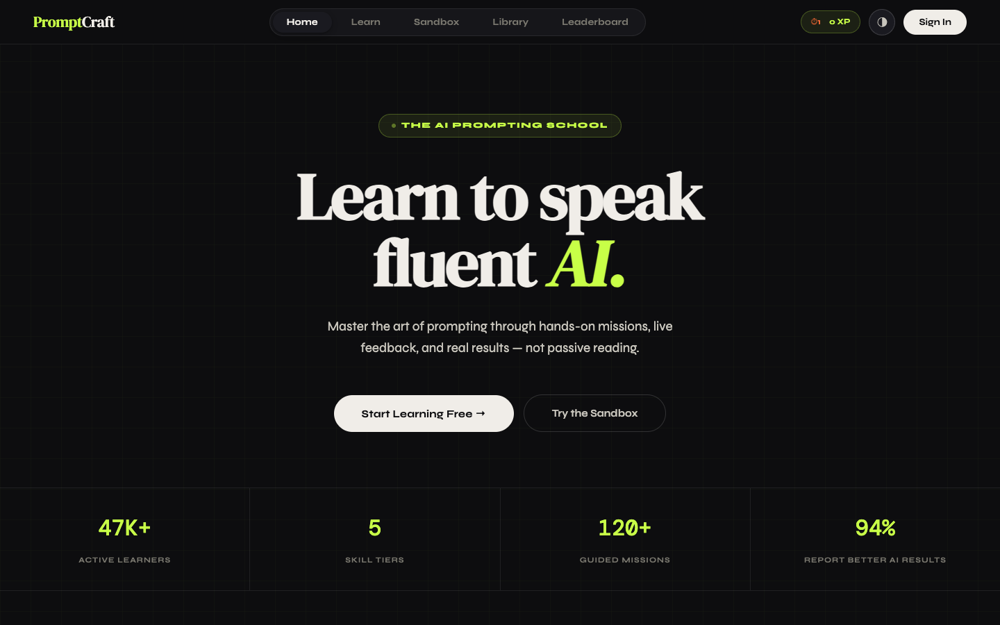

---

## Table of Contents

- [Features](#features)
- [Walkthrough](#walkthrough)
  - [Homepage](#homepage)
  - [How It Works](#how-it-works)
  - [Sign Up](#sign-up)
  - [Learning Path](#learning-path)
  - [Lessons](#lessons)
  - [Prompt Sandbox](#prompt-sandbox)
  - [Offline Scoring](#offline-scoring)
  - [Prompt Library](#prompt-library)
  - [Leaderboard](#leaderboard)
  - [Dark Mode](#dark-mode)
  - [Pricing](#pricing)
- [Tech Stack](#tech-stack)
- [Getting Started](#getting-started)

---

## Features

- **5 Skill Tiers** — Foundations, Core Techniques, Advanced Patterns, Domain Mastery, and Expert Challenges
- **Interactive Lessons** — Each lesson includes explanations, real-world examples, and before/after comparisons
- **AI-Powered Sandbox** — Write prompts, get a live AI response, a quality score (0–100), and targeted improvement tips
- **Offline Scoring** — Practice prompt structure without using AI runs via the rubric-based offline scorer
- **Prompt Dissector** — Paste any prompt and see it broken down into its core components (role, format, tone, constraint, context)
- **Guided Missions** — Real-world challenges with pass/fail evaluation
- **Community Prompt Library** — Browse, search, and copy high-quality prompts across categories
- **XP & Streaks** — Earn XP for completing lessons and practicing, with daily streak tracking
- **Leaderboard** — See how you rank against other learners
- **Dark/Light Mode** — Full theme support
- **User Accounts** — Sign up, log in, and have your progress synced to the server

---

## Walkthrough

### Homepage

The landing page introduces PromptCraft with key stats, a live sandbox preview, and a clear call to action.


### How It Works

A three-step breakdown of the learning flow: learn the concept, practice in the sandbox, and complete missions to prove mastery.

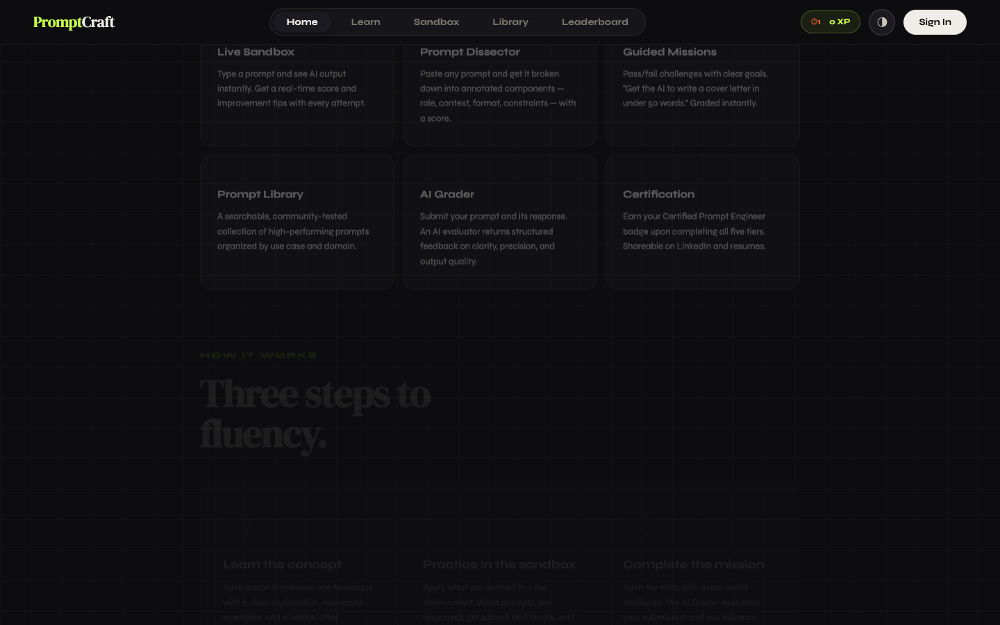

### Sign Up

Create a free account to unlock the sandbox, track your XP, and save progress across sessions.

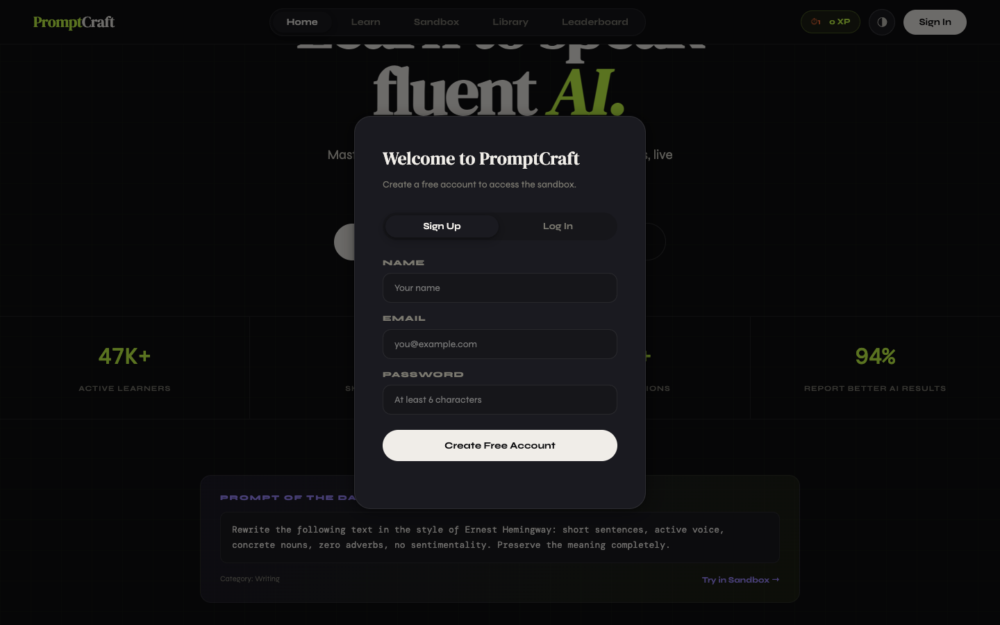

### Learning Path

Once signed in, the Learn view shows your progress dashboard — total XP, lessons completed, missions passed, and your current streak. Below that, skill tiers are laid out with individual lesson cards.

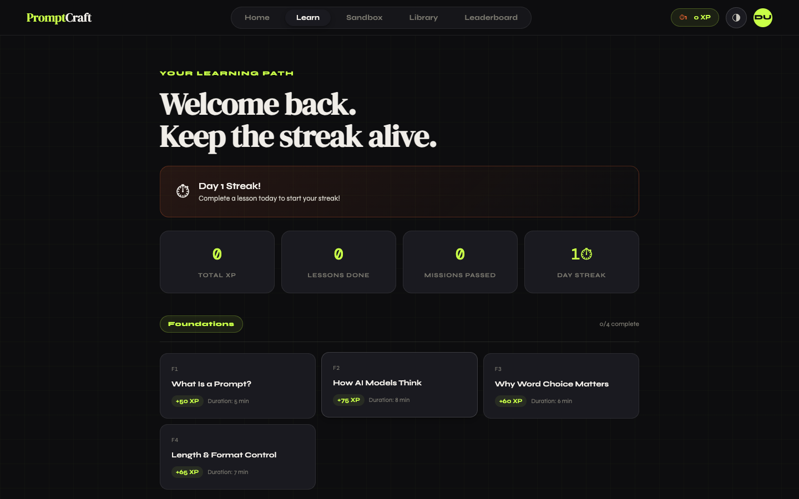

### Lessons

Click any lesson card to open a full lesson with explanations, examples, and a "Bad vs Good" prompt comparison. Mark it complete to earn XP.

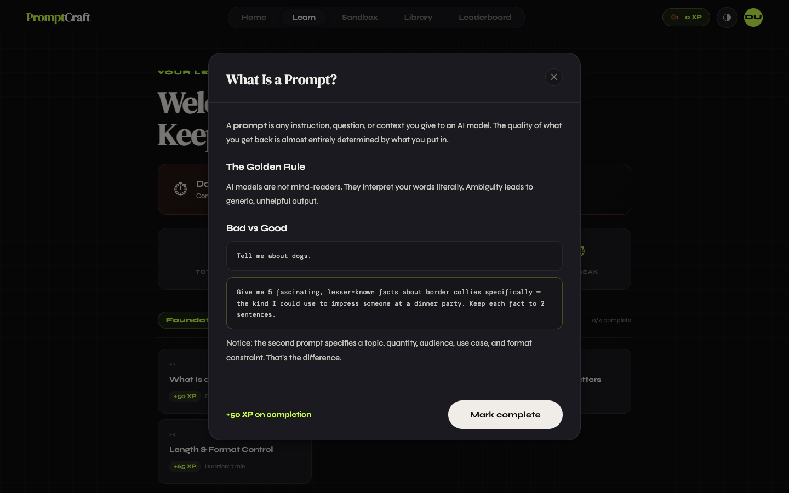

### Prompt Sandbox

The sandbox is where you put skills into practice. Write a prompt, choose a template if you want a starting point, and hit **Send to AI** to get:

- A **quality score** (0–100) based on role, format, tone, constraints, context, clarity, and specificity
- A **full AI response** to your prompt
- **Actionable feedback** with specific tips to improve
- A **rubric breakdown** showing points earned per category

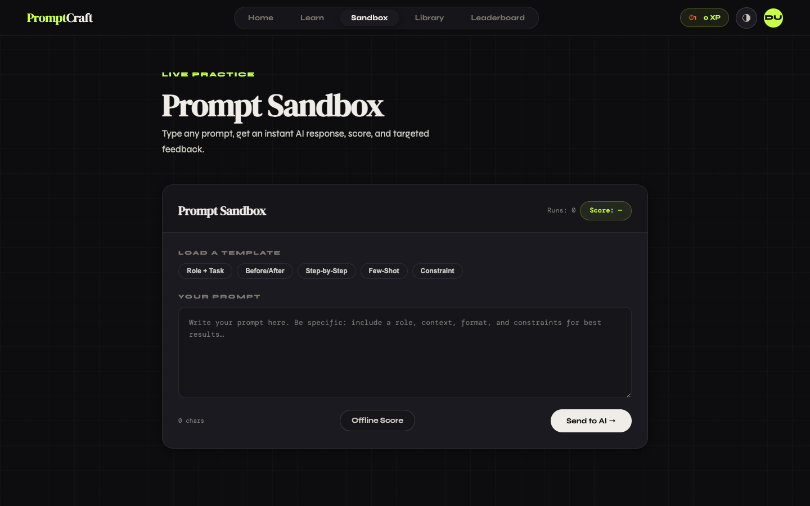

Here's what it looks like with a prompt typed in and ready to send:

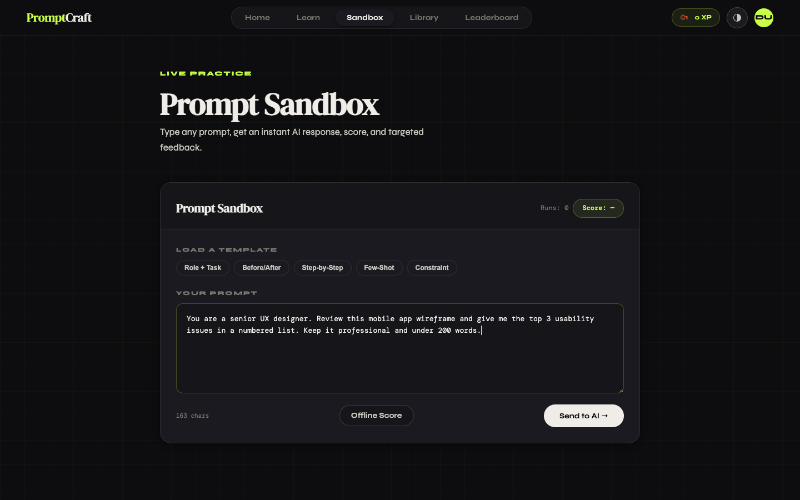

### Offline Scoring

Don't want to use an AI run? Hit **Offline Score** for an instant structural analysis. It detects which prompt components you've included (role, format, tone, constraints, context) and tells you exactly what's missing with specific suggestions.

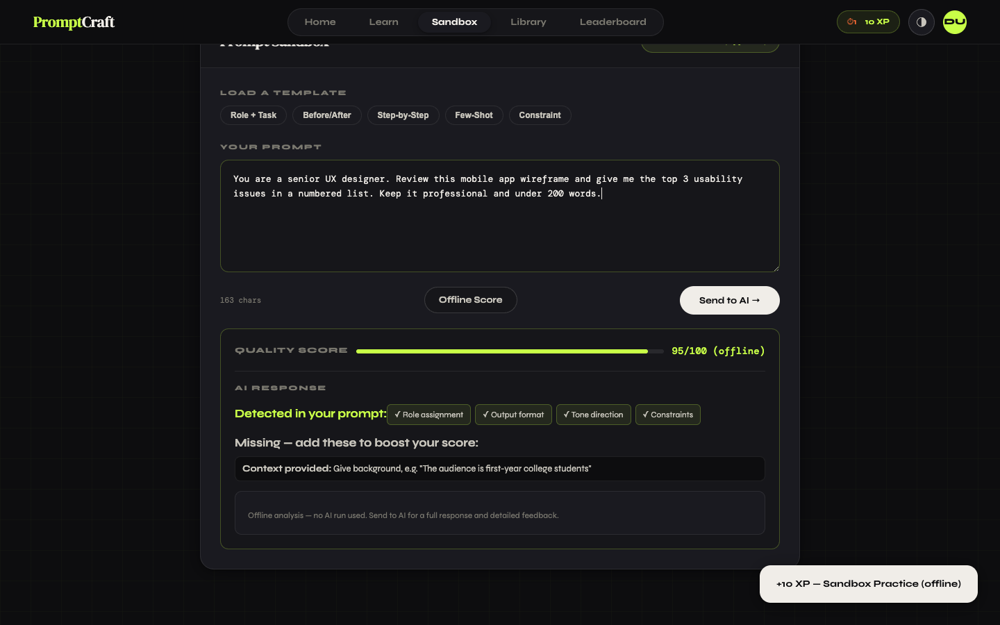

### Prompt Library

Browse community-tested prompts across categories like Writing, Code, Research, Marketing, Productivity, and Learning. Each prompt shows its quality score and usage count. Copy any prompt or send it straight to the sandbox.

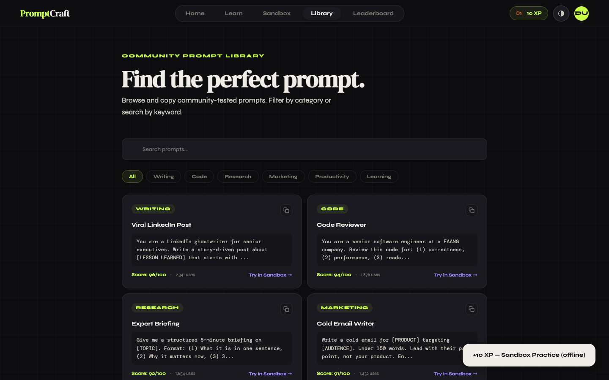

### Leaderboard

See the top learners ranked by XP. Compete with others and track your progress.

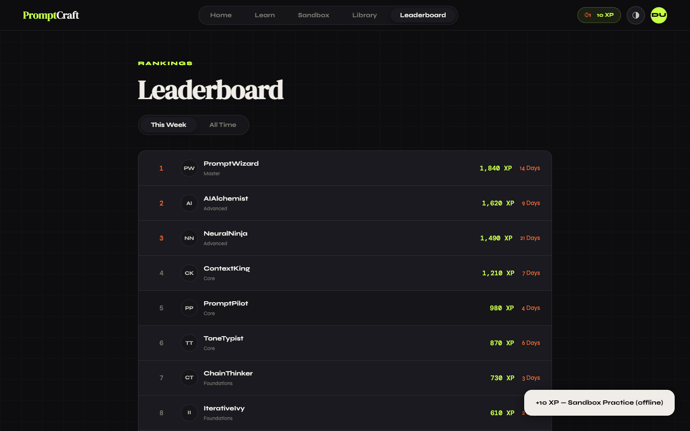

### Dark Mode

Toggle between light and dark themes with the button in the nav bar. The entire UI adapts seamlessly.

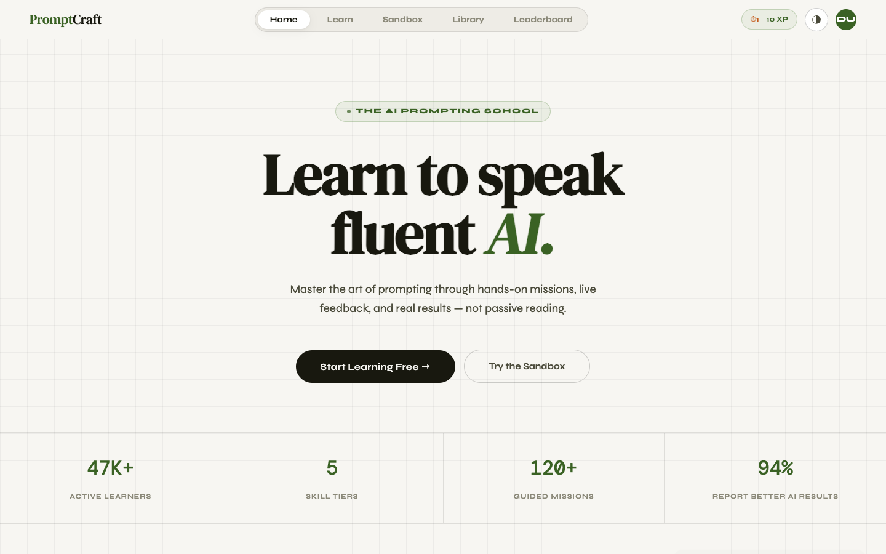

### Pricing

PromptCraft offers a free tier with access to the first two skill tiers and 10 AI sandbox runs per month. The Pro plan unlocks all five tiers, 140 AI runs per month, the AI grader and dissector, domain tracks, and a certification badge.

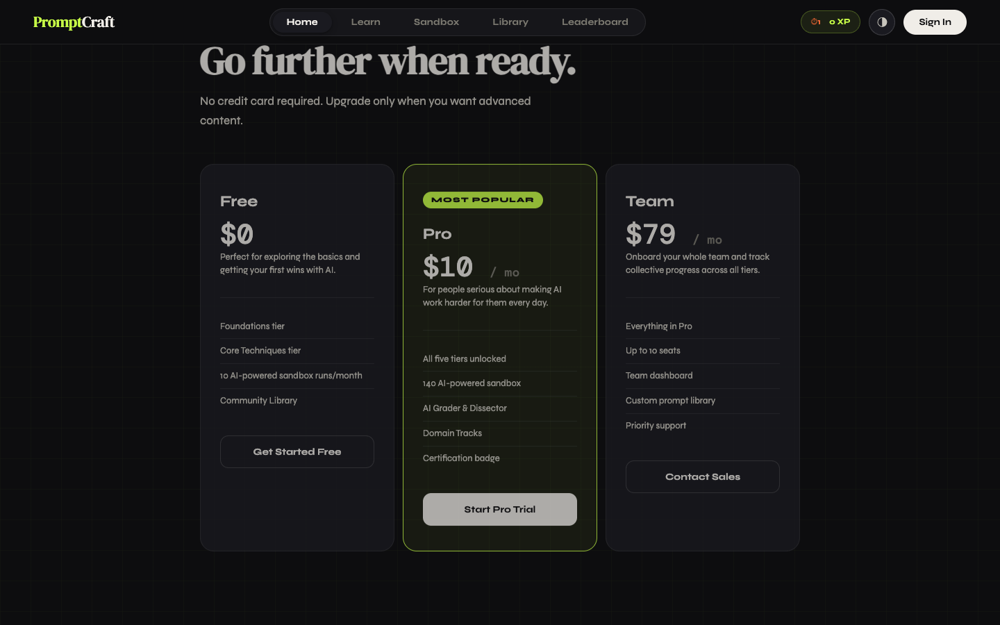

---

## Tech Stack

| Layer | Technology |
|-------|-----------|
| Frontend | Single-file HTML/CSS/JS (no framework) |
| Backend | Node.js + Express |
| AI | Google Gemini API (gemini-2.5-flash with automatic fallback) |
| Database | lowdb (JSON file-based) |
| Auth | JWT + bcrypt |

---

## Getting Started

### Prerequisites

- Node.js 18+
- A [Google Gemini API key](https://aistudio.google.com/app/apikey)

### Installation

1. Clone the repository:

   ```bash
   git clone <repo-url>
   cd Miles_Project
   ```

2. Install dependencies:

   ```bash
   npm install
   ```

3. Create a `.env` file in the project root:

   ```
   GEMINI_API_KEY=your_api_key_here
   ```

4. Start the server:

   ```bash
   npm run dev
   ```

5. Open [http://localhost:3000](http://localhost:3000) in your browser.

---

Built as a project for PromptCraft.
